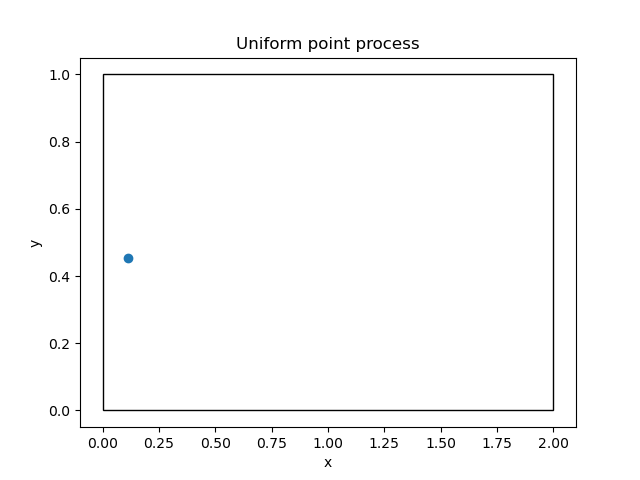
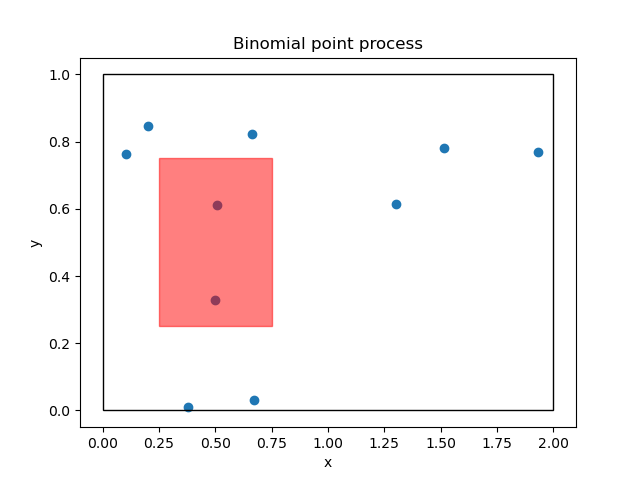
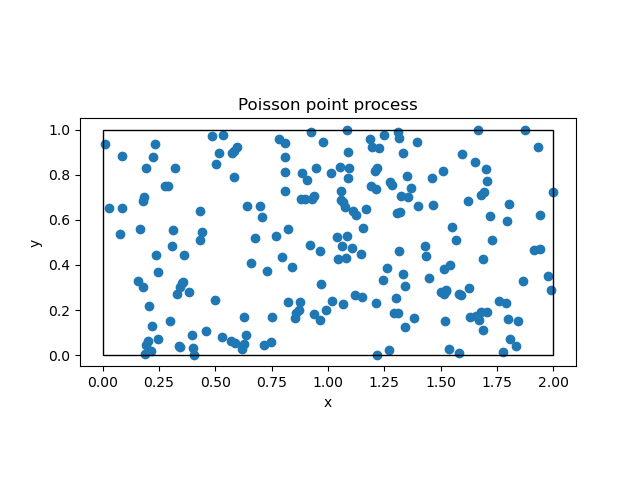
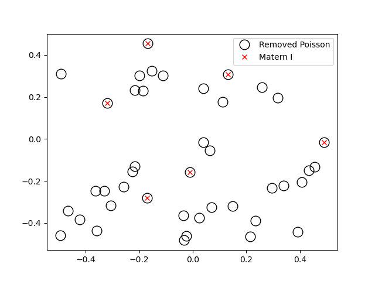
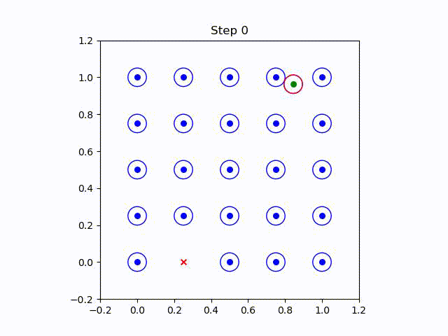

# Point Processes
This repository contains code for simulating and analyzing point processes. Point processes are stochastic models used to describe the occurrence of events in time or space. They have applications in a variety of fields, including neuroscience, ecology, and finance.

## Contents

### Uniform Point Process
- [uniform_point_process.py](./uniform_point_process.py): Python code for generating a random point using a uniform point process.

### Binomial Point Process
- [binomial_point_process.py](./binomial_point_process.py): In this script we generate a point pattern with fixed number of points with uniform probability

### Poisson Point Process
- [poisson_point_process.py](./poisson_point_process.py): The generated point pattern is one realisation of poisson point process with intensity &lambda; = 100

### Matern Point Process
- [matern_point_process.py](./matern_point_process.py): Here we generate a point pattern based on the matern I point process. I changed the code in a wonderfull overview of Point Processes by Paul Keeler that you can find [here](https://hpaulkeeler.com/simulating-matern-hard-core-point-processes/). It now contains only the type-I Matern PP.

### Strauss Point Process
- [strauss_point_process.py](./strauss_death_birth.py): In this script, I simulated a point pattern based on [Strauss Point Process](https://academic.oup.com/biomet/article-abstract/62/2/467/337198) using birth and death algorithm.

| Point Process Name | Final Result |
| --- | --- |
| Uniform Point Process |  |
| Binomial Point Process |  |
| Poisson Point Process |  |
| Matern Point Process |  |
| Strauss Point Process |  |
